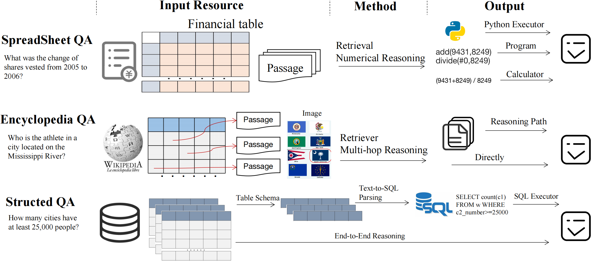
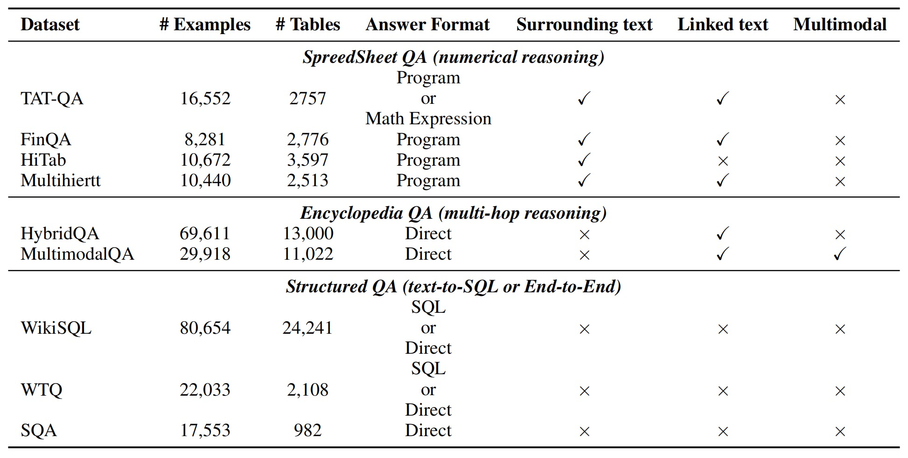

<div align="center">
  
  <br />
  <br />


[🌐Website](http://210.75.240.136:18888) |
[📦PyPI](https://www.baidu.com/)
[🤗Huggingface Datasets](https://huggingface.co/TableQAKit)

<!-- [📘Documentation](https://opencompass.readthedocs.io/en/latest/) |
[🛠️Installation](https://opencompass.readthedocs.io/en/latest/get_started.html#installation) | -->


</div>

# TableQAKit: A Toolkit for Table Question Answering

# 🔥 Updates

- [**2023-8-7**]: We released our [code](https://github.com/lfy79001/TableQAKit) and [PyPI](https://www.baidu.com). Check it out!

# ✨ Features
TableQAKit is a unified platform for TableQA (especially in the LLM era). Its main features includes:
- **Extensible disign**: You can use the interfaces defined by the toolkit, extend methods and models, and implement your own new models based on your own data.
- **Equipped with LLM**: TableQAKit supports LLM-based methods, including LLM-prompting methods and LLM-finetuning methods.
- **Comprehensive datasets**: We design a unified data interface to process data and store them in Huggingface datasets.
- **Powerful methods**: Using our toolkit, you can reproduce most of the SOTA methods for TableQA tasks.
- **Efficient LLM benchmark**: TableQAEval, a benchmark to evaluate the performance of LLM for TableQA. It evaluates LLM's modeling ability of long tables (context) and comprehension capabilities (numerical reasoning, multi-hop reasoning).
- **Comprehensive Survey**: We are about to release a systematic TableQA Survey, this project is a pre-work.


# 🔧 How to use

## Retrieval-then-Read Methods

### Retriever

#### QuickStart

MultiHiertt Dataset as a demonstration
```
from typing import Dict, List
import json
from retriever import MultiHierttTrainer


trainer = MultiHierttTrainer()
trainer.train()


args = get_training_args()
trainer = Trainer(training_args=args)
if args.train_path is not None:
    trainer.train()
if args.test_path is not None:
    for pred in trainer.test_iterator():
        # saving the predctions
```

#### Train
```
python main.py \
--train_mode row \
--per_device_train_batch_size 16 \
--per_device_eval_batch_size 1 \
--dataloader_pin_memory False \
--output_dir ./ckpt \
--train_path ./data/train.json \
--val_path ./data/val.json \
--save_steps 1000 \
--logging_steps 20 \
--learning_rate 0.00001 \
--top_n_for_eval 10 \
```

#### Inference
```
python infer.py \
--train_mode row \
--dataloader_pin_memory False \
--output_dir ./ckpt \
--test_path ./data/test-dev_out.json \
--ckpt_for_test ./ckpt/epoch3_step53000.pt \
--top_n_for_test 10 \
--encoder_path bert-base-uncased/
```

### Create Trainer for New Dataset
```
from retriever import RetrieverTrainer as RT

class NewTrainer(RT):
    def read_data(self, data_path: str) -> List[Dict]:
        """

        :param data_path: The path of data
        :return: List of raw data
        [
            data_1,
            data_2,
            ……
        ]
        """
        data = json.load(
            open(data_path, 'r', encoding='utf-8')
        )
        return data

    def data_proc(self, instance) -> Dict:
        """

        :return:
        {
            "id": str,
            "question": str,
            "rows": list[str],
            "labels": list[int]
        }
        """
        rows = instance["paragraphs"]
        labels = [0] * len(instance["paragraphs"])
        if len(instance["qa"]["text_evidence"]):
            for text_evidence in instance["qa"]["text_evidence"]:
                labels[text_evidence] = 1
        for k, v in instance["table_description"].items():
            rows.append(v)
            labels.append(1 if k in instance["qa"]["table_evidence"] else 0)
        return {
            "id": instance["uid"],
            "question": instance["qa"]["question"],
            "rows": rows,
            "labels": labels
        }
```

### TablePTM Reasoner


## LLM-Finetuning Methods


## LLM-Prompting Methods


# 🗃️ Dataset
According to our taxonomy, we classify the TableQA task into three categories of tasks, as shown in the following figure:

<p align="center">

</p>


<p align="center">

</p>


# Folder
The TableQAKit repository is structured as follows:

```bash
├── Baselines/ # scripts to generate the prediction files with baseline models
├── Evaluation/ # evaluation scripts
├── Leaderboard/ # csv files of results
├── LEval-data/ # test samples
│   ├── Exam/ # exact match tasks (like multiple-choice)
│   │   ├── test_file.jsonl 
│   │   └── ...
│   ├── Generation/ # generation tasks
│   │   ├── test_file.jsonl
│   │   └── ...
├── Predictions/ # output of models
│   ├── exam_eval/trubo-16k-0613
│   │              ├── <task_name>.pred.jsonl
│   │              └── ... 
│   ├── llm_gpt4_eval  
│   │             ├──<model_name>.pred.jsonl
│   ├── ...
├── Tools/ # useful scripts
├── figs/ # figures
├── LICENSE
└── README.md
```


# TableQAEval

<p align="center">

</p>

TableQAEval is a benchmark to evaluate the performance of LLM for TableQA. It evaluates LLM's modeling ability of long tables (context) and comprehension capabilities (numerical reasoning, multi-hop reasoning).

## Leaderboard

| Model | Parameters | Numerical Reasoning | Multi-hop Reasoning | Structured Reasoning | Total |
| ---   | ---        | ---                 | ---                 | ---                  | ---   |
| Turbo-16k-0613 | -     | 32.3               | 40.6 | 43.5 | 38.3 |
| longchat-7b-16k | 7B | 22.3 | 24.1 | 20.9 | 23.0 |
| xgen-7b-8k | 7B | 19.5 | 20.4 | 18.7 | 19.6  |
| mpt-7b-65k | 7B | 17.3 | 16.2 | 18.0 | 17.3 |
| LLaMA2-7b-chat | 7B | 16.2 | 18.4 | 20.1 | 18.6 |
| LLaMA2-7b-4k | 7B | 11.5 | 14.2 | 16.3 | 13.5 |
| LLaMA-7b-2k | 7B | 5.6 | 7.3 | 6.1 | 6.5 |


## QuickStart
```
pip install gunicorn

# 运行在210.75.240.136:18889,访问：http://210.75.240.136:18889
gunicorn -c gunicorn_config.py app:app --daemon

# 想要停止运行？
在gunicorn_error.log找到最新的记录Listening记录，如"Listening at: http://210.75.240.136:18889 (2609966)"
使用 kill 2609966 可实现停止运行

```


## 如何往PyPI上提交
0. 安装必要的工具
   ```bash
   pip install setuptools wheel twine
1. 先修改setup.py这个文件
2. 生成分发文件。在命令行中运行以下命令以生成源代码压缩包和轮子（wheel）分发文件：
   ```bash
    python setup.py sdist bdist_wheel
3. 使用twine上传到测试 PyPI。运行以下命令以将您的分发文件上传到测试 PyPI：
    ```bash 
    twine upload --repository-url https://test.pypi.org/legacy/dist/*
    ```
    UserName: lfy79001

    PassWord: 20010213lfyLFY!
4. 访问 https://test.pypi.org/project/ttqakit
5. 上传到正式的
    ```bash
    twine upload dist/*
    ```
    访问 https://pypi.org/project/ttqakit
6. 完毕后可以安装
    ```bash
    # 正式版
    pip install ttqakit
    # test版
    pip install --index-url https://test.pypi.org/simple/ttqakit


