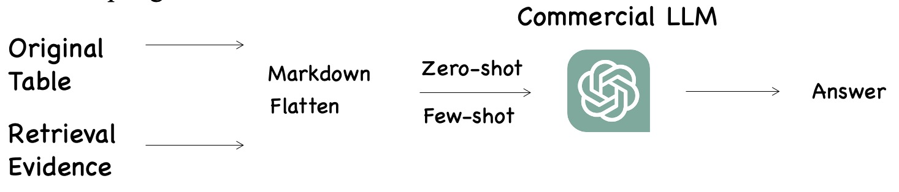
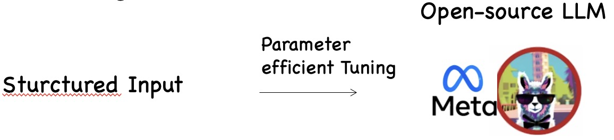

<div align="center">
  
  <br />
  <br />


[🌐Website](http://210.75.240.136:18888) |
[🎥Video](https://youtu.be/6Ty6z9qlKlk) |
[📦PyPI](https://pypi.org/project/ttqakit/) |
[🤗Huggingface Datasets](https://huggingface.co/TableQAKit)

<!-- [📘Documentation](https://opencompass.readthedocs.io/en/latest/) |
[🛠️Installation](https://opencompass.readthedocs.io/en/latest/get_started.html#installation) | -->


</div>

# TableQAKit: A Toolkit for Table Question Answering

# 🔥 Updates

- [**2023-8-7**]: We released our [code](https://github.com/lfy79001/TableQAKit), [datasets](https://huggingface.co/TableQAKit) and [PyPI Package](https://www.baidu.com). Check it out!

# ✨ Features
TableQAKit is a unified platform for TableQA (especially in the LLM era). Its main features includes:
- **Extensible design**: You can use the interfaces defined by the toolkit, extend methods and models, and implement your own new models based on your own data.
- **Equipped with LLM**: TableQAKit supports LLM-based methods, including LLM-prompting methods and LLM-finetuning methods.
- **Comprehensive datasets**: We design a unified data interface to process data and store them in Huggingface datasets.
- **Powerful methods**: Using our toolkit, you can reproduce most of the SOTA methods for TableQA tasks.
- **Efficient LLM benchmark**: TableQAEval, a benchmark to evaluate the performance of LLM for TableQA. It evaluates LLM's modeling ability of long tables (context) and comprehension capabilities (numerical reasoning, multi-hop reasoning).
- **Comprehensive Survey**: We are about to release a systematic TableQA Survey, this project is a pre-work.


# ⚙️ Install
```
pip install tableqakit
or
git clone git@github.com:lfy79001/TableQAKit.git
pip install -r requirements.txt

pip install ttqakit
```


<!-- # Folder
The TableQAKit repository is structured as follows:

```bash
├── icl/ # LLM-prompting toolkit
│   ├── dataset.py  
│   ├── infer.py
│   ├── model.py
│   └── utils.py
├── llama/ # LLM-finetuning toolkit
│   ├── data_collator.py 
│   ├── dataset.py 
│   ├── model.py
│   ├── peft_trainer.py
│   ├── seq2seq.py
│   ├── template.py
│   ├── Trainer.py
│   └── utils.py
├── mmqa_utils/ # EncyclopediaQA toolkit
│   ├── classifier_module/ # The package for classifier
│   │   ├── dataset.py
│   │   ├── model.py
│   │   ├── train.py
│   │   ├── trainer.py
│   │   └── utils.py
│   ├── retriever_module/ # The package for encyclopedia retrieval
│   │   ├── dataset.py
│   │   ├── model.py
│   │   ├── train.py
│   │   ├── trainer.py
│   │   └── utils.py
├── structuredqa/ # Read model TaLMs
│   ├── builder/
│   │   ├── hybridqa.py
│   │   ├── msr_sqa.py
│   │   ├── wikisql_tapas.py
│   │   ├── wikisql.py
│   │   ├── wikitq_tapas.py
│   │   └── wikitq.py
│   ├── utils/
│   │   ├── common.py
│   │   ├── configure.py
│   │   ├── dataset.py
│   │   ├── tapas_utils.py
│   │   ├── tapas_wikisql_utils.py
│   │   └── tapex_wikisql_utils.py
├── retriever/ # TableQA's general retriever （SpreadSheet examples）
│   ├── dataset.py
│   ├── model.py
│   ├── trainer.py
│   └── utils.py
├── multihop/ # Readers for encyclopediaQA
│   ├── Retrieval/
│   └── Read/
├── numerical/ # Readers for some TableQA datasets
├── TableQAEval/ # The proposed new LLM-Long-Table Benchmark
│   ├── Baselines/ # Add your LLMs
│   │   ├── turbo16k-table.py
│   │   ├── llama2-chat-table.py
│   │   └── ...
│   ├── Evaluation/ # metrics
│   └── TableQAEval.json  
├── outputs/ # the results of some models
├── loaders/ 
│   ├── WikiSQL.py
│   └── ...
├── structs/ 
│   ├── data.py
├── static/ 
├── LICENSE
└── README.md
``` -->


# 📁 Folder
The TableQAKit repository is structured as follows:

```bash
├── icl/ # LLM-prompting toolkit
├── llama/ # LLM-finetuning toolkit
├── mmqa_utils/ # EncyclopediaQA toolkit
│   ├── classifier_module/ # The package for classifier
│   ├── retriever_module/ # The package for encyclopedia retrieval
├── structuredqa/ # Read model TaLMs
│   ├── builder/
│   ├── utils/
├── retriever/ # TableQA's general retriever （SpreadSheet examples）
├── multihop/ # Readers for encyclopediaQA
│   ├── Retrieval/
│   └── Read/
├── numerical/ # Readers for some TableQA datasets
├── TableQAEval/ # The proposed new LLM-Long-Table Benchmark
│   ├── Baselines/ # Add your LLMs
│   │   ├── turbo16k-table.py
│   │   ├── llama2-chat-table.py
│   │   └── ...
│   ├── Evaluation/ # metrics
│   └── TableQAEval.json  
├── outputs/ # the results of some models
├── loaders/ 
│   ├── WikiSQL.py
│   └── ...
├── structs/ 
│   ├── data.py
├── static/ 
├── LICENSE
└── README.md
```


# 🗃️ Dataset
According to our taxonomy, we classify the TableQA task into three categories of tasks, as shown in the following figure:

<p align="center">

</p>


<p align="center">

</p>


# 🔧 Get started

## Retrieval Modules

#### QuickStart

MultiHiertt Dataset as a demonstration
```
from TableQAKit.retriever import CompAQTTrainer

trainer = CompAQTTrainer()

if trainer.train_set is not None:
    trainer.train()
if trainer.val_set is not None:
    trainer.eval()
if trainer.test_set is not None:
    for pred in trainer.test_iterator():
        print(pred)

```

#### Train
```
python main.py \
--train_mode row \
--per_device_train_batch_size 16 \
--per_device_eval_batch_size 1 \
--dataloader_pin_memory False \
--output_dir ./ckpt \
--train_path ./data/train.json \
--val_path ./data/val.json \
--save_steps 1000 \
--logging_steps 20 \
--learning_rate 0.00001 \
--top_n_for_eval 10 \
--encoder_path ./PLM/bert-base-uncased/
```

#### Inference
```
python infer.py \
--train_mode row \
--dataloader_pin_memory False \
--output_dir ./ckpt \
--test_path ./data/test-dev_out.json \
--ckpt_for_test ./ckpt/epoch3_step53000.pt \
--top_n_for_test 10 \
--encoder_path ./PLM/bert-base-uncased/
```

### Create Trainer for New Dataset
```
from TableQAKit.retriever import RetrieverTrainer as RT

class NewTrainer(RT):
    def read_data(self, data_path: str) -> List[Dict]:
        """

        :param data_path: The path of data
        :return: List of raw data
        [
            data_1,
            data_2,
            ……
        ]
        """
        data = json.load(
            open(data_path, 'r', encoding='utf-8')
        )
        return data

    def data_proc(self, instance) -> Dict:
        """

        :return:
        {
            "id": str,
            "question": str,
            "rows": list[str],
            "labels": list[int]
        }
        """
        rows = instance["paragraphs"]
        labels = [0] * len(instance["paragraphs"])
        if len(instance["qa"]["text_evidence"]):
            for text_evidence in instance["qa"]["text_evidence"]:
                labels[text_evidence] = 1
        for k, v in instance["table_description"].items():
            rows.append(v)
            labels.append(1 if k in instance["qa"]["table_evidence"] else 0)
        return {
            "id": instance["uid"],
            "question": instance["qa"]["question"],
            "rows": rows,
            "labels": labels
        }
```

## LLM-Prompting Methods

<p align="center">

</p>

Check [hear](https://github.com/lfy79001/TableQAKit/tree/main/TableQAKit/icl) for more details.

## LLM-Finetuning Methods


<p align="center">

</p>

Check [hear](https://github.com/lfy79001/TableQAKit/tree/main/TableQAKit/llama) for more details.

## Reading Modules


### TaLM Reasoner

Check [hear](https://github.com/lfy79001/TableQAKit/tree/main/TableQAKit/structuredqa) for more details.

### Multimodal Reasoner

Check [hear](https://github.com/lfy79001/TableQAKit/tree/main/TableQAKit/mmqa_utils) for more details.


# TableQAEval

<p align="center">

</p>

TableQAEval is a benchmark to evaluate the performance of LLM for TableQA. It evaluates LLM's modeling ability of long tables (context) and comprehension capabilities (numerical reasoning, multi-hop reasoning).

## Leaderboard

| Model | Parameters | Numerical Reasoning | Multi-hop Reasoning | Structured Reasoning | Total |
| ---   | ---        | ---                 | ---                 | ---                  | ---   |
| Turbo-16k-0613 | -     | 20.3     | 52.8 | 54.3 | 43.5 |
| LLaMA2-7b-chat | 7B | 2.0 | 14.2 | 13.4 | 12.6 |
| ChatGLM2-6b-8k | 6B | 1.4 | 10.1 | 11.5 | 10.2  |
| LLaMA2-7b-4k | 7B | 0.8 | 9.2 | 5.4 | 6.6 |
| longchat-7b-16k | 7B | 0.3 | 7.1 | 5.1 | 5.2 |
| LLaMA-7b-2k | 7B | 0.5 | 7.3 | 4.1 | 4.5 |
| MPT-7b-65k | 7B | 0.3 | 3.2 | 2.0 | 2.3 |
| LongLLaMA-3b | 3B | 0.0 | 4.3 | 1.7 | 2.0 |


More details are shown in [TableQAEval](https://github.com/lfy79001/TableQAKit/tree/main/TableQAKit/TableQAEval).


## ✅ TODO
We will continue to optimize the toolkit.


